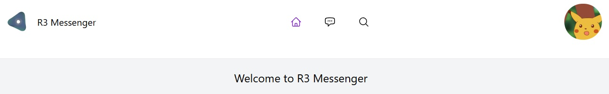
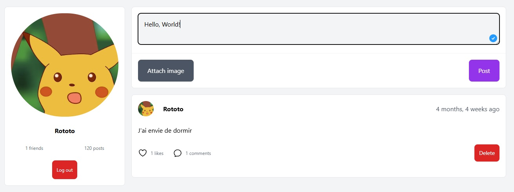
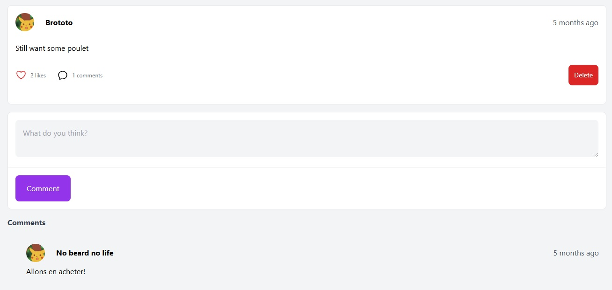
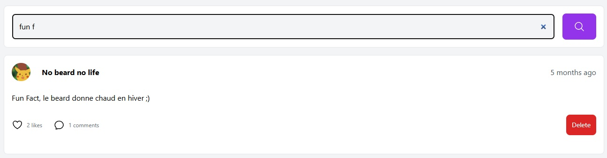
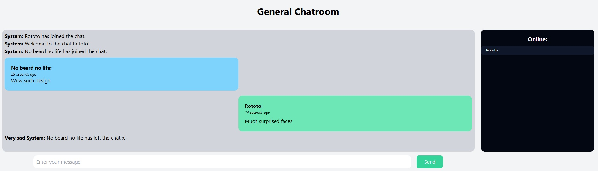

## Notes: 
- The readme is being on updated to include screenshots and setup instructions
- This app is being rewritten into a Microservices architecture with it's own full DevOps workflow
  
---
  
# PROJECT: Social media app with a live chat [ENG/FR]

**Personal Wall / Espace personnel**  

  
**You can comment and like status / Possibilité d'aimer et commenter un statut** 

  
**Dynamic user search / Recherche dynamique d'utilisateurs**

  
**Dynamic post search / Recherche dynamique de posts** 

  
**Live chat / Chat en direct**  

  
## Tech Stack:
### Front end
- Vue3 Framework
- Tailwind CSS
- Socket.IO Client

### Back end
- Django Framework
- Socket.IO (python server side for real time communication)

### Database
- SQLite

## [ENG]
***Notes***
This project was made in the context of the 3 months long training "Formation Professionnalisante Python"
provided by *M2i Formation*
It was made in 3 weeks as a final project.

Logo Credit: Full credit to ***Nicolas Robouam*** for the logo design. 
The logo is entirely his work, and I claim no ownership or rights over it.

The github_protocol.txt and R3_setup_protocol.txt were early attempts at documentation created during the first week of the project. They are not up to date.

## [FR]
***Remarques***
Ce projet a été réalisé dans le cadre de la formation intensive de 3 mois « Formation Professionnalisante Python »
dispensée par M2i Formation.
Il a été développé en 3 semaines en tant que projet final.

Crédit du logo: Tout le crédit revient à ***Nicolas Robouam*** pour la conception du logo. 
Le logo est entièrement son œuvre, et je ne revendique aucun droit ni aucune propriété à son sujet.

Les fichiers github_protocol.txt et R3_setup_protocol.txt sont des premières tentatives de documentation réalisées durant la première semaine du projet. Ils ne sont pas à jour.
